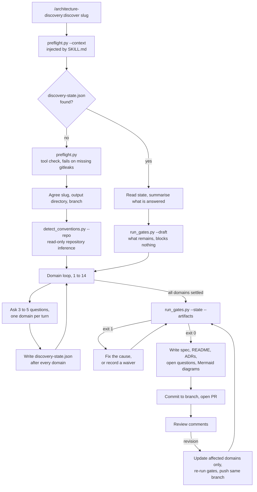

# Discovery: the interview

How the `discover` skill turns a requirements conversation into a reviewable
specification: the runtime loop, how a decision travels from a spoken answer to a
committed artifact, what each of the five gates refuses, and what verifies them.

For the generation that implements the result, see [`GENERATION.md`](GENERATION.md).
For what both stages share, see [`HOW-IT-WORKS.md`](HOW-IT-WORKS.md).

## Contents

- [Runtime flow](#runtime-flow)
- [How a decision is taken](#how-a-decision-is-taken)
- [The gates](#the-gates)
- [The verification harness](#the-verification-harness)

## Runtime flow



Two properties of that loop matter more than the steps:

- **State is written per domain, not at the end.** An interview spans days and will
  outlive a compaction. What survives is the file.
- **Gates run before emission, never after.** A contradiction found during the
  interview costs a question. The same contradiction found after sign-off costs a
  redesign.


## How a decision is taken

### The eight standing rules

`SKILL.md` opens with them because they have to survive compaction. In brief:

1. **The state file is the interview.** Written after each domain, not at the end.
2. **Write nothing you were not told.** An empty section beats a plausible one.
3. **Never invent a number, never assert compliance.** Derive from stated assumptions
   or ask; map obligations to proposed controls and evidence, never to a verdict.
4. **Never block.** An unknown becomes an open question with a proposed default, a
   named owner and a date the default takes effect.
5. **One domain at a time, three to five questions per turn.** With options, a
   recommended default and a one-line trade-off. Pre-fills are always labelled as
   inferences.
6. **Secure by default; a deviation is a recorded waiver** naming the control, the
   deviation, the reason and who accepted it.
7. **Run the gates before emitting, never after.**
8. **Load a reference only when its domain is in play.**

Four of the eight are machine-enforced. Rule 1 by the secret scan, which covers the
state file because it gets committed; rule 3 by the cost and compliance gates; rule 4
by the completeness gate, which refuses to treat an open question as an answer; rule 6
by the contradiction gate, which warns where a secure default looks to have been
departed from. Rule 7 *is* the gates. Rules 2, 5 and 8 — write nothing you were not
told, the per-turn question limit, load references lazily — are prompt discipline with
no automated check behind them.

### Fourteen domains, seven of which block

The order is causal: each domain's answers narrow the next. Product context and the
cost of an outage come first because everything hangs off them; cost and operations
come last, once there is something to cost.

A domain **blocks** a final specification when defaulting it would be a guess about
the *business*:

| Blocking | Why no default exists |
|---|---|
| 01 Product context | There is no technical default for a business requirement. |
| 03 Compliance | A regime discovered after the design is a redesign — segmentation, key custody and retention all move the topology. |
| 04 Cloud and region | Decides which managed services exist at all. |
| 06 Compute platform | Defaulting it defaults most of the specification. |
| 12 Data, backup and DR | RTO and RPO are commercial decisions about what an outage costs. |
| 13 Cost | With no ceiling, affordable and ruinous read identically. |
| 14 Team and operations | Two people and a platform team have different correct answers. |

The other seven — application shape, environments, networking, identity, delivery,
observability, security posture — have defensible technical defaults. They are filled
from `references/secure-defaults.md` and recorded in the spec **as defaults rather
than as decisions**, so a reviewer can see they were never actually chosen.

A gate that refuses on everything is a gate somebody switches off. That is why the
split exists and why it is encoded once, in `scripts/_state.py`.

### Earlier answers close later branches

The gating graph lives per domain in the reference files. The edges that change an
interview most:

- **Serverless or FaaS** closes node strategy and ingress controller entirely; opens
  cold-start tolerance, concurrency limits, per-invocation cost.
- **PCI-DSS** opens CDE segmentation (7), key custody (8), twelve-month log retention
  (10), pen-test cadence (11), change control (9).
- **GDPR or India DPDP** opens residency, retention and erasure (12), and data-subject
  access (8).
- **RBI, SEBI or IFSCA** opens incident-reporting deadlines, third-party review and DR
  drill cadence — and the entity's regulatory classification has to be established
  before any control list means anything.
- **A team of two, or nobody on a pager** tilts 6, 8, 9 and 10 toward managed. A
  self-hosted control plane chosen anyway is a contradiction, not a preference, and
  the contradiction gate treats it as one.
- **On-premises or bare metal** changes most domains rather than one: isolation becomes
  physical, there is no spot market or managed node group, SPIFFE/SPIRE replace IRSA,
  internal PKI stops being optional, storage becomes a first-class decision, and cost
  inverts to capital expenditure with amortisation.

### Answer keys are a vocabulary, not free text

Most answers can be recorded under any key. A short list cannot:
`ANSWER_KEYS` in `scripts/_state.py` names the keys gates read by name, per domain —
`sla`, `regimes`, `provider`, `region`, `environments`, `platform`, `rto`,
`headcount`, `pager`, `iac`, and a few optional ones.

A paraphrase there does not make a gate wrong, it makes it **blind**. The bug this
came from: `{"team_size": 2, "on_call": "nobody"}` with a self-hosted control plane
passed the contradiction gate clean, because the rule reads `headcount` and `pager`.
Now `check_completeness.py` refuses a domain marked `complete` whose required keys are
absent, and prints the unrecognised keys it found instead, so the rename is obvious.

Two of those keys are read by the *generation* skill rather than by a gate here, and
a paraphrase is worse across that boundary than within it. `09-delivery.iac` decides
whether the stack is Terraform, OpenTofu or Terragrunt; `09-delivery.policy_pre_apply`
decides which policy scanner `check_iac.py` runs. Recorded as `scanner`, the
generation gate read an empty string and reported that the specification had named no
scanner at all — a sentence about a decision nobody made, printed on a passing run.

Regime naming has the same hazard and the same fix: `normalise_regime()` and
`REGIME_ALIASES` live in `_state.py`, so every gate spells a regime the same way.
Before that, `["cscrf"]` in a US region passed the residency check that
`["sebi-cscrf"]` failed.

### Deviations, and the limit of what a gate can judge

Secure defaults are the starting point and are not argued: private subnets, least
privilege, encryption in transit and at rest, no publicly reachable data stores, no
long-lived static credentials.

A departure needs a waiver in the state file — control, deviation, reason, who
accepted it. **Recording it is the human's job, not the gate's.**
`check_contradictions.py` matches the words a control uses, not their sense; it cannot
distinguish "no public data stores" from "the database is public". So it warns, names
the control, and leaves the judgement where it belongs. A deviation nobody records is
a deviation nothing downstream catches.

### Unknowns do not stall, and do not count as answered

Rule 4 keeps the interview moving: an unknown becomes a row in `open-questions.md`
with a proposed default, an owner and a date. Rule 7 keeps that honest: a blocking
domain whose answer is still an open question is **unanswered**, and
`check_completeness.py` says so. Otherwise "never block" quietly becomes "never
finish".

The owner and the date are the whole consideration in that bargain, so an open
question missing either one **fails the completeness gate**. It used to be listed and
not counted, which made the one rule that stops "deferred" meaning "dropped" the one
rule with nothing behind it. `--draft` still reports it without blocking, because
mid-interview is exactly when an owner is not yet known.

A decision recorded in `decisions[]` is checked the same way — for its shape, never
for how many there are. How many ADRs a project needs is a judgement about the
project, and a gate demanding a number gets one written to satisfy it; but a decision
that is recorded owes a `title`, a `rationale` and at least one rejected alternative
with a reason. Without them the specification's promise — what was chosen, what was
rejected and why — is a list of tool names.


## The gates

`run_gates.py` is the only gate command run by hand. It invokes the five gates as
subprocesses, with argument lists and no shell — which is also why the skill's
`allowed-tools` needs only three rules: a subprocess of an already-permitted command
needs no rule of its own.

| Order | Gate | Reads | Fails when |
|---|---|---|---|
| 1 | `check_completeness.py` | state | A blocking domain is unanswered, a `complete` domain's required answer keys are missing, an open question has no owner or date, or a recorded decision has no rationale or rejected alternative |
| 2 | `check_contradictions.py` | state | Two answers cannot both be satisfied |
| 3 | `check_compliance.py` | state, `compliance_controls.json` | An obligation is unaddressed, or a named regime is a stub |
| 4 | `check_cost.py` | state | A price carries no assumptions, or the total exceeds the ceiling |
| 5 | `scan_secrets.py` | written artifacts | A credential, key or account identifier reached the documents |

The order is not cosmetic. Completeness first, because costing and compliance-checking
a draft as though it were finished produces confident nonsense. Contradictions next,
since they can invalidate answers the later gates depend on. Compliance and cost are
independent of each other. The secret scan runs last because it is the only gate that
reads written output rather than state.

A failing early gate does not stop the later ones: one report with five problems beats
five runs finding one problem each.

### Exit codes

Shared across gates, and the distinction is load-bearing:

| Code | Meaning |
|---|---|
| 0 | Passed |
| 1 | The gate's own verdict: it found the thing it looks for |
| 2 | The gate never reached a verdict — for the four state-reading gates, the state file is missing or malformed (or, for the compliance gate, the control map is unreadable); for `scan_secrets.py`, the target does not exist or a report could not be parsed |
| 3 | `scan_secrets.py` only: `gitleaks` is absent, so nothing was scanned |

`run_gates.py` itself uses the same three codes: 0 all passed or `--draft`, 1 at least
one gate failed, 2 the arguments are wrong or a gate script is missing.
`detect_conventions.py` exits 0 whether or not it found anything, and 2 only when the
path it was given is not a directory. `preflight.py` exits 0 or 1.

`run_gates.py` reports 2 and 3 as "never ran" rather than as a verdict. It used to
print the verdict blurb for all three, which reported a missing state file as "a
blocking domain is unanswered" and a missing `gitleaks` as a secret found. A gate that
did not run has not passed, and the summary says so explicitly.

`--draft` reports everything, blocks nothing, and skips the secret scan because
nothing is written yet. It always exits 0.

### Inside the contradiction gate

Thirteen named rules across three severities. Two of them —
`residency-vs-region` and `budget-vs-topology` — fire at either error or warning
depending on how far apart the answers are, so severity is a property of the finding
rather than of the rule.

- **error** — the two answers cannot both be satisfied. Something has to change.
  `residency-vs-region`, `residency-vs-dr-region`, `provider-service-mismatch`,
  `sla-vs-single-az`, `team-vs-self-hosted`, `pager-vs-self-hosted`, `pager-vs-sla`,
  `rto-vs-dr-tier`, `dr-tier-without-dr-region`, `budget-vs-topology`,
  `pci-vs-isolation`.
- **warning** — both can be true, but the combination is usually a mistake.
  `sla-vs-single-region`, `pci-vs-account-model`, `unknown-provider`,
  `secure-default-without-waiver`, and the softer forms of the two dual-severity
  rules. `--strict` makes these fail too.
- **advisory** — verify by hand; no answer in the state file can clear it. One rule,
  `region-availability-unverified`. Never gates, not even under `--strict`.

The third severity exists because it was needed. Whether a specific managed service
exists in a specific region is a live fact no offline table can be trusted for. Filed
as a warning, it made `--strict` fail on a perfectly consistent state file — which
would have meant `--strict` never being switched on and the real warnings never
gating anything. A permanently-failing check trains people to ignore the checker.

### Inside the compliance gate

The control map is `scripts/compliance_controls.json`: per regime, a residency
obligation where one exists, and a list of obligation → proposed control → evidence
an assessor would ask for.

"Addressed" means **every domain the obligation depends on has been answered**. That
is a weak test on purpose, and it must not be read as more: it says the interview
covered the ground, never that the resulting control satisfies the obligation. The
output is a worklist for a person.

Where the primary text states a number, the control carries a `verify` line and the
gate prints it whether the obligation is addressed or not. "Domains answered" is the
weakest possible claim about an obligation with a figure in it — a seven-day log
retention answers domain 10 and misses IFSCA's thirty-day root-cause window by three
weeks — so those obligations are named individually with what a reviewer has to
check. It stays prose rather than a threshold check, because whether an answer meets
a deadline is a reading of the answer, and the two sourced cases here are GDPR's
72-hour notification and IFSCA's 3-day and 30-day reports.

Six regimes carry controls — GDPR (6), India DPDP (6), PCI-DSS (7), RBI (6), SEBI (5),
IFSCA (4). Three are stubs with zero controls — **HIPAA, ISO 27001, SOC 2** — because
their primary texts could not be retrieved during the build. Naming one of those
**fails** the gate. An empty control list would otherwise render as "0 obligations
unaddressed", which reads exactly like a clean bill of health, and that is the most
dangerous output this script could produce.

Applicability is never inferred. Where the control map records an applicability note —
the RBI Master Direction is addressed to named entity types, the SEBI framework varies
by classification — the gate prints it and leaves it unresolved, because whether a
client falls inside is a question for the client.

### Inside the cost gate

There is no price list, and that is a decision rather than an omission. A table
compiled today is wrong within months, varies by region, and cannot see committed-use
or negotiated rates; a stale table that looks authoritative removes the prompt to go
and check. So numbers come from whoever ran the interview, assumptions come with them,
and the gate checks the arithmetic and the ceiling.

A price with no stated assumptions is a **failure**, not a warning: a figure with no
assumptions attached is indistinguishable from one that was made up, and once it has a
currency symbol beside it somebody will plan against it. Something nobody can price
yet is marked `"unpriced": true` with a note, and reported as explicitly unpriced.

Two models: `"model": "cloud"` sums monthly line items. `"model": "on-prem"` accepts
`capex` with `life_years` plus `opex_monthly` and compares
`capex / (life_years × 12) + opex_monthly` against a monthly ceiling. If power,
cooling, rack space, bandwidth commits or hardware refresh are missing from an on-prem
estimate the report says so, because leaving them out is how on-premises comes to look
cheaper than it is.

A cloud estimate gets the same treatment for the charges that arrive because the
workload is in a cloud at all rather than because somebody chose them: egress and the
NAT path, cross-zone traffic where the design spans zones, log and metric ingestion
where domain 10 was answered, backup and snapshot storage, the standing cost of a DR
region where one is recorded, and the load balancer itself. Each is gated on
something the interview actually recorded, and none of them changes the exit code —
the gate cannot know what a line item was meant to include, so this is a prompt to
think rather than a verdict.

Prices are read with `_state.num()`, which parses `73`, `"73"`, `"$73"`, `"73 USD"`
and `"20,000 USD"`, and reads `1.2k` as 1200 — but returns nothing for `"lots"` rather
than guessing. The state file is written from a spoken conversation, so a bare
`float()` died on the third form.

### Inside the secret scan

Two classes of finding, reported separately so the reader knows which problem they
have, and both blocking.

**`gitleaks`** covers credentials and keys. **Eleven patterns in
`scan_secrets.py`** cover what `gitleaks` deliberately does not, because they are not
secrets: AWS account numbers (inside an ARN, labelled, or bare twelve digits), ECR
registry hostnames, GCP project identifiers, Azure subscription and tenant GUIDs, RDS
and other managed-service endpoint hostnames, internal hostnames, JDBC strings
carrying credentials, and URLs with inline basic auth.

Not secrets, but still not ours to publish: an account identifier plus a role name is
most of what a role-assumption attempt needs, and an ECR hostname discloses both the
account and the region.

Each pattern is tagged `certain` or `review` — `review` marks one that cannot be made
precise without context, such as a bare twelve-digit number. Both tags block. A false
positive costs a glance; a false negative costs an account identifier in a public
repository.

It fails closed. A pass means "these files were scanned and were clean"; with no
scanner there is no basis for that claim, and reporting success in the moment before a
credential is committed is the most expensive possible lie. Exit 3 is kept distinct
from exit 1 so "found something" and "could not look" are not confused — they need
different fixes.

Scanning nothing is also not a pass: an empty or mistyped target directory exits 2. It
used to print "clean, nothing found" and exit 0, indistinguishable from a real pass.

### Inside convention detection

`detect_conventions.py` walks the repository — bounded depth, a file cap, the usual
vendor directories skipped — and maps filename and content signals to interview
domains: Terragrunt, Terraform, CDK, Pulumi, Bicep, SAM/CloudFormation, Ansible,
Helm, Kustomize, Helmfile, CI configuration for seven systems (GitHub Actions, GitLab
CI, Bitbucket Pipelines, Jenkins, Azure Pipelines, CircleCI, Woodpecker), Dockerfiles,
Compose, Talos and serverless manifests, alongside content markers read out of file
bodies.

Three properties are deliberate:

- **Every finding carries the file that evidenced it.** A detected convention is an
  inference and inferences are sometimes wrong. The repository this was designed
  against specifies no ArgoCD and installs add-ons through the Terraform helm
  provider, while the house default is ArgoCD. Presented as fact, that pre-fill puts
  the wrong tool into a signed-off specification; presented as "detected X, evidenced
  by Y, confirm?" it costs one turn and cannot go wrong quietly.
- **Comments are stripped before content matching.** Every questionable finding in the
  first run against the exemplar repository came from a comment — `ingress-nginx`
  named in a subnet comment, `cluster-autoscaler` in an IRSA module's docstring. Those
  tools were being discussed, not configured.
- **Domains with no signal are reported as "no signal".** An absent backup tool or log
  pipeline is a question to ask, not an omission from the report.

Finding nothing exits 0. It is a valid result, not a failure.

Scope limit worth knowing: the detector was designed by reading **two** real layouts,
not many ([`LIMITATIONS.md`](../LIMITATIONS.md) L8). On an unfamiliar layout it
degrades to asking rather than guessing, which is the intended failure direction — but
that is not evidence of broad coverage, and every pre-fill it produces still needs
confirming.


## The verification harness

```bash
python3 skills/discover/scripts/selftest.py
```

Everything below is what it checks, and the harness prints one line per check. This is the gate on the
interview's gates, and the thing to run after touching anything in
`skills/discover/scripts/`. Generation has its own, built the same way —
see [`GENERATION.md`](GENERATION.md#the-generation-harness). Run both after touching either,
since `scan_secrets.py` and the clean state fixture are shared.

### How it is built

**Fixture pairs, asserted on exit codes.** Every gate runs twice: once against a state
it must accept, once against a state it must reject. A gate that never fires is
indistinguishable from a gate that always passes, and the second is the failure mode
that matters, because it reads as a clean bill of health.

Exit codes are asserted rather than report wording, so the harness breaks when the
behaviour changes and not when a sentence is reworded.

**Fixtures are built, not committed.** One `CLEAN` state — answered throughout,
internally consistent, priced with assumptions, under its ceiling, naming a regime
whose text was sourced — and each violating case is `CLEAN` mutated in exactly one
place. A committed fixture tree drifts from the schema it is supposed to pin; a
one-line mutation states in one place precisely what makes the case a violation.

### What it asserts

Paired clean/violating cases:

| Gate | Violation injected |
|---|---|
| `check_completeness.py` | `13-cost` set back to `not-started` |
| `check_completeness.py` | `14-team` answered as `team_size`/`on_call` instead of `headcount`/`pager` |
| `check_completeness.py` | `09-delivery` answered as `tool`/`scanner` instead of `iac`/`policy_pre_apply` — the keys the generation skill reads |
| `check_completeness.py` | An open question with a proposed default and nobody to ask |
| `check_contradictions.py` | Self-hosted control plane with a team of two |
| `check_compliance.py` | `hipaa`, whose primary text was never sourced |
| `check_cost.py` | A $400 line item with `assumptions: []` |
| `check_cost.py` | Ceiling dropped to $50 |
| `scan_secrets.py` | An artifact containing an AWS account id and an ECR host |

Cross-file consistency:

- `RESIDENCY_REGIMES` in `check_contradictions.py` must agree with
  `compliance_controls.json` in both directions — no regime claiming a residency the
  control map does not record, and no residency obligation in the map that the
  contradiction gate cannot check. They disagreed once: IFSCA was listed as carrying
  an India residency obligation while the control map recorded `null`. Two tables in
  two files, neither reading the other.
- Every alias of a regime must reach the same verdict as its canonical spelling —
  `sebi`, `sebi-cscrf`, `cscrf`, `SEBI_CSCRF` all flag an offshore region.

Pinned regressions, each one a bug that is not allowed back:

- Ordinary English does not read as a provider mismatch: "we need cloud storage for
  backups" passes, "backups go to GCS" on AWS fails.
- An answer that affirms a secure default warns rather than erroring, and `--strict`
  still gates on it.
- `check_cost.py` reads `"$73"` and a `"20,000 USD"` ceiling, and refuses `"lots"`.
- `scan_secrets.py` exits 2 on an empty target, never 0.
- `run_gates.py --draft` exits 0, and does **not** run the secret scan while reporting
  that it did — asserted on the output text, not the exit code, because the summary
  understating what the security gate actually did is the one direction that must
  never happen.
- `run_gates.py` reports exit 2 as "never ran" rather than as the gate's own verdict.

The secret-scan case is skipped **loudly** when `gitleaks` is absent, since the gate
itself exits 3 there, which is neither a pass nor a failure.

### What it does not cover

Worth being explicit, because "there is a harness" invites more confidence than is
due:

- **No evaluation of the interview's judgement.** Nothing here tests whether the
  interview asks good questions, respects the three-to-five limit, or labels pre-fills
  as inferences. Those are prompt rules in `SKILL.md` with no automated check behind
  them, and that is a deliberate omission rather than a backlog item: grading a
  judgement call costs model calls to produce a noisy verdict, and a suite people stop
  believing is worse than none. Generation's rule 3 is the exception, and it is
  enforced by a hook rather than measured by a grader.

  What *is* measured is routing, which is not a judgement — a skill fired or it did
  not. [`evals/`](../evals/README.md) holds six `claude plugin eval` cases: three
  phrasings that must reach a skill, three that must reach neither. It exists because
  every anti-trigger instruction this plugin has lives in `when_to_use`
  ([`LIMITATIONS.md`](../LIMITATIONS.md) L11) and nothing else reads it, and because
  the two skills overlap on purpose — the failure that costs something is `iac` firing
  on a conversation that never produced a specification. Not in CI: a model call per
  case buys nothing on a commit that edited a script.
- **No full end-to-end run.** No test drives an interview and inspects the artifacts,
  and none plans a generated stack against a real account — the second would need
  cloud credentials to mean anything. What does run is the cheap slice:
  `scripts/check_repo.py` proves every reference, grant, version and anchor the
  repository declares actually exists, and CI builds the harness's clean fixture
  stack and puts it through all nine gates with both binaries present.
- **`claude plugin validate` does not parse `SKILL.md`** (see
  [`LIMITATIONS.md`](../LIMITATIONS.md) L10). `scripts/check_repo.py` covers part of
  what it would: the frontmatter parses, carries the keys the skill depends on, and
  agrees with `plugin.json` on the version.

A gate added without a case in `selftest.py` is a gate with no evidence it does
anything.

