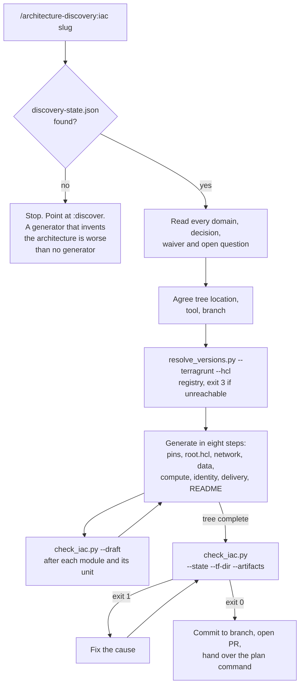

# Generation: the infrastructure code

How the `iac` skill turns an approved specification into a Terragrunt and
Terraform stack: what it reads, what it refuses to write, and what judges the result.

For the interview that produces its input, see [`DISCOVERY.md`](DISCOVERY.md). For
the hook and the secure-defaults gate, see [`GUARDRAILS.md`](GUARDRAILS.md). For what
both stages share, see [`HOW-IT-WORKS.md`](HOW-IT-WORKS.md).

## Contents

- [The stack it writes](#the-stack-it-writes)
- [The nine standing rules](#the-nine-standing-rules)
- [Why provenance is a gate and not a convention](#why-provenance-is-a-gate-and-not-a-convention)
- [Why version resolution is a script, and why it reaches the network](#why-version-resolution-is-a-script-and-why-it-reaches-the-network)
- [The task plan, and generating in parallel](#the-task-plan-and-generating-in-parallel)
- [The nine gates](#the-nine-gates)
- [Why `fmt` and `validate` each cover both tools](#why-fmt-and-validate-each-cover-both-tools)
- [The generation harness](#the-generation-harness)

## The stack it writes

The interview's output is the generation's input. Nothing else is.

Two layers, one job each. **Terraform writes the modules**: resources, typed inputs,
described outputs, no environment knowledge, no backend and no provider block.
**Terragrunt composes them into environments**: one `root.hcl` generating the backend
and the provider for every unit, one thin unit per component per environment,
dependency ordering between them, one state file each.

The alternative — a `backend.tf` and a `providers.tf` copied into every environment
directory — is where those copies drift, and the drift is invisible until a change
tested in staging behaves differently in production. Below roughly three components
Terragrunt is a second tool earning nothing, and where domain 9 recorded plain
Terraform the skill follows the specification.




## The nine standing rules

Same structure as the interview's, and at the top of `SKILL.md` for the same reason —
generation outlives compaction and only the beginning of the file reliably returns.

1. **The specification is the input, and the only one.** Every resource traces to a
   domain answer, an ADR or a recorded waiver.
2. **Never invent a version.** `resolve_versions.py` or ask.
3. **Never apply, never destroy, never touch a real account.**
4. **Nothing sensitive in the stack.** A derived state bucket name, variables for
   identifiers, secrets from the store domain 8 chose.
5. **Write code a reviewer will recognise.** `references/conventions.md`, four rules
   of which are gated by `conventions` and thirteen more by
   [`guardrails`](GUARDRAILS.md).
6. **The secure defaults were decided, not proposed.** Write them; a deviation needs a
   waiver that already exists, and if one does not, stop and ask.
7. **An unknown becomes a variable with no default**, its description naming the open
   question.
8. **Format and validate both halves, after every file** — not once at the end, and
   the first module is the checkpoint that matters: a finding there is a class of
   finding, and fixing the class before the second module is written is the
   difference between one edit and six.
9. **Load a reference when its question is in play.**

Rules 1, 2, 3, 4, 5, 6 and 8 are machine-enforced — provenance, pins, the secret
scan, the conventions gate, the guardrails gate, the formatting and validation gates,
and for rule 3 a `PreToolUse` hook. Rules 7 and 9 are prompt discipline with nothing
automated behind them.

Rule 3 used to be the exception that mattered most: nothing in the repository could
stop a model running `terraform apply` except its own compliance. That is now the
`PreToolUse` hook in [`GUARDRAILS.md`](GUARDRAILS.md).

Rule 5 is gated only in part, deliberately. Four rules that are always right —
variables typed and described, outputs described, no `provider` block in a child
module — are worth more than twenty that are usually right, because a gate producing
findings nobody can act on is a gate people learn to skip. Everything else in that
reference needs judgement about the code, and so it is written down rather than
checked.


## Why provenance is a gate and not a convention

The characteristic failure of a generator is not a wrong resource. It is a
**plausible** one nobody asked for — a NAT gateway per availability zone in a
specification that never discussed egress cost, a KMS key nobody will rotate, a second
environment that does not exist. A wrong resource fails review. A plausible one passes
it, gets applied, and is billed monthly forever.

So every `.tf` file **and every Terragrunt `.hcl` file** must carry, in its first
twelve lines:

```hcl
# spec: domain 07-networking, ADR-004 — three private subnets, one per availability zone
```

The gate checks the line exists. It cannot check the line is true — a header citing
ADR-007 for something ADR-007 never discussed passes, which is
[`LIMITATIONS.md`](../LIMITATIONS.md) L13. What it buys is that the question "which
decision is this?" gets asked while the file is being written rather than in review,
and that an untraceable file is visible rather than merely unnoticed. One line per
file is a cheap price for that.

The unit files matter here as much as the modules. A `terragrunt.hcl` is where an
environment's shape is actually decided — which module, which inputs, which
dependencies — so a unit nobody can trace to a decision is a whole component nobody
agreed to, not one resource.


## Why version resolution is a script, and why it reaches the network

This is the one place the plugin's offline property is broken, so it is worth stating
what was traded for what.

A model asked for the latest AWS provider version answers from its training data. That
answer is wrong in the worst available direction: `~> 5.0` written long after 6.x
shipped is syntactically fine, reviews clean, and silently freezes a project a major
version behind. It is rule 3 of the interview — never invent a number — applied to a
number that happens to be a version.

The alternatives were a bundled table or asking every time. A table compiled at build
time is wrong within weeks and looks authoritative while it is wrong, which is exactly
the reasoning that keeps a price table out of the cost gate. Asking every time is
correct but makes the common case tedious enough that it gets skipped.

So: one script, four public unauthenticated read-only endpoints, nothing about the
project sent — a request carries a provider name and nothing else. And it **fails
closed**: exit 3, nothing resolved, no fallback. Exit 1 is kept distinct for a name
that does not exist, because "that provider is misspelled" and "I could not look" need
different fixes.

Pins are exact for providers and registry modules, and `~> x.y` for `required_version`.
The asymmetry is deliberate: a provider patch can change a resource schema, while a
Terraform patch is a bug fix, and pinning the latter forces every engineer and CI image
to move in lockstep for nothing.


## The task plan, and generating in parallel

`plan_tasks.py` is the step between reading the state file and writing the first
resource. It answers two questions that were previously answered by judgement each
time: **which components does this specification imply**, and **which of them can be
written at the same time**.

It derives components from domain answers — a trigger pattern per component, matched
only against the domains that would decide it, so "cache" in a cost line is not a
decision to build one. A domain recorded `not-applicable` produces no task, and the
plan prints what it left out with the reason, because a component missing from the
plan is a component missing from the stack and the omission has to be visible.

Waves come from the dependency edges between components, which are the canonical
apply order in another form: `registry -> network -> data -> identity -> compute ->
observability`, with `edge` and `messaging` hanging off network and compute. Within a
wave nothing waits on anything else, which is precisely the property that makes it
safe to hand each task to a different agent at once — where handing it out is worth
doing at all.

### Why the default is one thread

Waves describe what *could* run at once; they are not an instruction to. Writing the
components one at a time, gating after each, is the default and the right one for most
stacks — one naming convention, one reading of the state file, one memory of what the
last module named its outputs, and the same nine gates either way. Agents are reached
for on three conditions: a wave with three or more substantial components, a context
long enough that compaction is a real risk, or a component that should be reviewed by
something that did not write it. The third stands on its own with no parallelism at
all, which is why `iac-validator` is the one of the three worth using on any stack.

The plan makes that judgement cheap rather than making it for you: it prints how many
tasks a wave holds, so "three or more" is a line to read rather than a count to keep.

### Why three agents rather than one

| Agent | Reads | Writes | Why it is separate |
|---|---|---|---|
| `iac-planner` | one component's domains, ADRs, provider rows | nothing | Planning and writing in one pass is how a resource gets written and justified afterwards. Separating them puts "which decision is this?" before the file exists. |
| `iac-builder` | its plan | only `modules/<component>/` and `live/<env>/<component>/` | Disjoint file ownership is what makes several builders in one tree safe. It never edits a shared file; a conflict is reported, not resolved locally. |
| `iac-validator` | the written component and the state file | nothing | The gate checks what a regex can check. Whether a provenance header is *true*, and whether anything here was actually asked for, needs reading — and reading your own output is the weakest review there is. |

### What the main thread keeps

The shared files are written **before** any fan-out: the version files, `.gitignore`,
the marker, `root.hcl`, every `env.hcl`, and the resolved provider versions. Those are
the files every component reads and none owns, and writing them up front removes the
only failure mode parallelism introduces rather than managing it.

The real gate is the main thread's too. Agents run `check_iac.py --draft`, which
reports without blocking, over their own files; the run that decides is without
`--draft`, over the whole tree, after the wave. So is every waiver: an agent that
meets a secure default it cannot satisfy stops and reports, because a waiver names
the person who accepted the risk and an agent cannot be that person.

A wave is fixed before the next one starts, for the same reason rule 8 names the
first module as the checkpoint. A finding in wave 1 is rarely one finding — it is a
class of finding, and with six builders running it is repeated six times at once.

## The nine gates

`check_iac.py` is the only gate command run by hand. Like `run_gates.py`, it
invokes everything else as subprocesses with argument lists and no shell, which is why
this skill's `allowed-tools` needs only four rules. One of them is `preflight.py`,
which probes the two IaC binaries, gitleaks and the scanner domain 9a chose before
the first file is written.

| Order | Gate | Reads | Fails when |
|---|---|---|---|
| 1 | `spec` | state, artifacts | The discovery skill's five gates do not all pass |
| 2 | `pins` | the stack | A provider, registry module, unit source or either tool version names no released version, or `.terraform-version` / `.terragrunt-version` is missing |
| 3 | `provenance` | the stack | A `.tf` or Terragrunt `.hcl` file has no `# spec:` line in its first twelve |
| 4 | `conventions` | the modules | A variable is untyped or undescribed, an output undescribed, or a called module configures its own provider |
| 5 | `guardrails` | the stack, the waivers | A resource contradicts a secure default and no waiver records the deviation — see [`GUARDRAILS.md`](GUARDRAILS.md) |
| 6 | `graph` | the units | Two units depend on each other in a circle, so no apply order exists |
| 7 | `fmt` | the stack | `terraform fmt -check -recursive` **or** `terragrunt hcl fmt --check` reports a file |
| 8 | `validate` | modules and units | `terraform init -backend=false` or `validate` fails for a non-network reason, **or** `terragrunt hcl validate` rejects the units |
| 9 | `secrets` | the stack | `scan_secrets.py` finds a credential, key or identifier |

Gate 6 is static — it reads `dependency` and `dependencies` edges out of the unit
files and looks for a cycle — so unlike `fmt` and `validate` it always runs. It
exists because `terragrunt hcl validate` cannot see a cycle: it evaluates each unit's
configuration without resolving the graph, so a stack where compute depends on
observability and observability depends on compute validates clean, and only
`terragrunt run --all` finds it. That needs credentials, so without this gate the
first person to meet the cycle meets it at the first real plan.

The fix for a cycle is an ownership decision rather than a rearranged `config_path`:
a resource belongs to the module that writes to it, and where two modules both claim
it, the earlier one in apply order wins. `references/layout.md` states the canonical
order — `registry -> network -> data -> identity -> compute -> observability` — and
the tie-break rule with it.


## Why `fmt` and `validate` each cover both tools

Because a stack half-checked is not a stack checked. `terraform fmt` does not touch
`terragrunt.hcl` and `terragrunt hcl fmt` does not touch `.tf`, so a gate running one
of them leaves the other half to be reformatted by whoever notices in CI — and every
diff after that is noise nobody reads.

So both halves run every time, and their verdicts combine: **any failure fails**;
otherwise **any half that could not run makes the whole gate "did not run"**. The
second half of that rule is the load-bearing one. Reporting a pass on the strength of
the half that happened to be installed is the silent pass this plugin is built around
avoiding, and a machine with `terraform` but no `terragrunt` is the common case rather
than an edge one.

`terragrunt hcl validate` parses and evaluates the unit configurations — that the
includes resolve, the sources are readable, the HCL is well-formed. It does not
resolve `dependency` outputs and it is not a plan. `--inputs` additionally
cross-checks each unit's inputs against its module's variables; that needs the modules
initialised, so it is left out of the gate for the same reason `plan` is.

One real finding from building this, which is now a documented rule rather than a
leniency in the gate: `get_env("TF_STATE_BUCKET")` with no default in `root.hcl` makes
the entire stack fail `hcl validate` on any machine that has not exported the
variable — which is every machine, at the moment the code is being written. The state
bucket name is derived from locals the repository already holds instead.

Gate 1 runs the discovery gates **for real, never with `--draft`**. `--draft` always
exits 0, so a draft run there would report a passing spec gate whatever the
specification said — a decorative gate, which is the failure this whole plugin is built
around. That is why `--artifacts` is required rather than optional, and the first
version of this script had the bug: its own harness caught it.

Terraform is validated **per directory holding `.tf` files**, not per detected root
module. In a Terragrunt stack nothing declares a backend or a provider — `root.hcl`
generates both — so there are no root modules to find, and validating only those would
validate nothing and report a pass. `init -backend=false` in a child module infers its
providers from `required_providers` and validates it standalone.

A child module is identified by **being called**: a `module` block or a Terragrunt
`terraform { source = "../..." }` names the directory it points at. That replaced the
structural test — declares a backend or configures a provider — which was
self-defeating for the conventions rule that a child module must not configure a
provider: adding the forbidden block was exactly what made the directory look like a
root and exempted it from the check. Being called is not something a module can grant
itself. `--root` still overrides, for a layout this gets wrong.

`fmt` and `validate` report **"did not run"** when the binary is absent, and `validate`
does the same when `init` fails for a recognised connectivity reason. Anything else
from `init` is a failure: a tree that will not initialise is not ready for review
whatever the reason. The classification is by message rather than by cause, which is
L16 — read the printed output, not only the verdict.


## The generation harness

```bash
python3 skills/iac/scripts/selftest.py
```

Built the same way as the interview's: one clean stack — a
Terragrunt unit over a Terraform module, with `root.hcl`, `env.hcl` and both tool
versions pinned — that every gate must accept, and each violating case that stack
mutated in exactly one place.

| Gate | Violation injected |
|---|---|
| `pins` | `~> 6.0` in place of an exact provider version |
| `pins` | A `version` that is only inside a comment |
| `pins` | A module with no `required_version` |
| `pins` | `.terraform-version` deleted |
| `pins` | `.terragrunt-version` deleted from a Terragrunt stack |
| `pins` | A unit whose `terraform.source` is remote with no `?ref=` |
| `provenance` | `main.tf` with its `# spec:` line removed |
| `provenance` | `terragrunt.hcl` with its `# spec:` line removed |
| `conventions` | A variable with no `description` |
| `conventions` | A variable with no `type` |
| `conventions` | An output with no `description` |
| `conventions` | A `provider` block in a called module |
| `guardrails` | SSH open to `0.0.0.0/0` |
| `guardrails` | `publicly_accessible = true` on a database |
| `guardrails` | `storage_encrypted = false` |
| `guardrails` | A literal password in a resource |
| `guardrails` | A secret-shaped variable with a default |
| `guardrails` | `mock_outputs` with no command restriction |
| `spec` | A state file with `13-cost` set back to `not-started` |

Three of the guardrail checks are asserted in the other direction, which is where the
value is: a public load balancer on `0.0.0.0/0:443` must **not** be a finding, a
waiver must waive its own control while the finding stays visible in the report, and
a waiver for one control must not waive another.

Two more cover what the gate says about a scanner it cannot drive. A specification
naming one of the four it runs is scanned; one naming anything else — KICS, Snyk,
an in-house wrapper — is reported as **not run**, because printing nothing made that
case indistinguishable from a scan that found nothing. And an answer that opens with
"none" or "not" is a decision rather than a tool, so it is reported as no scanner
chosen and not as one the gate failed to find.

The hook has ten cases of its own — four commands that must be denied, five that must
not, and one that must be untouched because it is outside a generated stack — plus an
assertion that malformed input fails open.

Plus: an empty tree exits 2 rather than passing clean, `--draft` reports a failing gate
without blocking, `resolve_versions.py` raises `Unreachable` for a host it cannot reach
rather than falling back to anything, and both entry-point scripts carry the executable
bit their `allowed-tools` rule needs to match.

The clean **state** fixture is imported from the discovery skill's harness rather than
restated, so the two cannot drift on what a valid state file looks like. It is loaded
by file path rather than by name, because both skills have a `selftest.py` and
`import selftest` would otherwise resolve by `sys.path` order.

`fmt` and `validate` are skipped by name and the skip is printed: they need both
binaries, and `validate` needs a reachable registry. A test that fails on a train is a
test that gets deleted. Both were exercised by hand against the clean fixture with
Terraform 1.15.8 and Terragrunt 1.1.1 installed — all nine gates pass — and against
three injected violations: a misformatted `terragrunt.hcl`, a `terragrunt.hcl` with a
broken `include`, and `get_env` with no default. Each failed the gate it should.

Two defects the harness found in the scripts it was written for, both of the silent-pass
kind:

- The `spec` gate fell back to `--draft` when `--artifacts` was absent, so it reported
  a passing specification for a state file with an unanswered blocking domain.
- The fixture helper encoded `/` and `.` into keyword argument names and produced
  `.terraform.version` where the case meant `.terraform-version` — so the case that was
  supposed to delete the tool version file created a second file instead, and the gate
  passed. A fixture bug that reads exactly like a gate bug.
- The conventions rule "no `provider` block in a child module" exempted the module the
  moment the block was added, because the block was also what the root-module test
  looked for. The rule passed its own violation. Fixed by identifying a child module
  by being called rather than by what it contains.

And two in the discovery skill, both surfaced by running the secret scan over a tree
that had been initialised. `scan_secrets.py` walked `.terraform/`, so every
credential-shaped string in every vendored third-party module landed in the report
ahead of the reader's own — those directories are now excluded from the identifier
patterns and from the gitleaks findings alike. And its bare-account-id pattern
excluded adjacent digits but not adjacent letters, so a twelve-digit run inside a hex
digest matched: every committed `.terraform.lock.hcl` reported two account identifiers
that were four characters of somebody's SHA. Both are pinned by a case in the discovery
harness.

Neither was reachable from discovery alone — nothing an interview writes contains a
checksum or a vendored module — which is the argument for the two harnesses sharing
fixtures rather than each testing its own skill in isolation.

